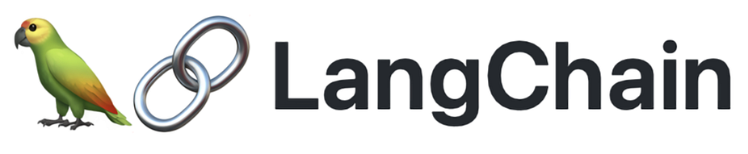

# Llama-2-Langchain-Ray-Pinecone

## Build a scalable enterprise-grade Q&A with Llama-2 on AWS using Pinecone and Ray
An example on how to use Anyscale and Pinecone on AWS to build an LLM application using Retrieval Augmented Generation (RAG).

[Llama-2](https://ai.meta.com/llama/) Llama 2 are a collection of pretrained and fine-tuned large language models (LLMs) ranging in scale from 7 billion to 70 billion parameters. Our fine-tuned LLMs, called Llama 2-Chat, are optimized for dialogue use cases.

[Langchain](https://python.langchain.com/docs/get_started/introduction) LangChain is a framework for developing applications powered by language models. It enables applications that are:

1. Data-aware: connect a language model to other sources of data
2. Agentic: allow a language model to interact with its environment

[Ray](https://docs.ray.io/en/latest/) is A general-purpose, open source, distributed compute framework for scaling AI applications in native-Python.

[Pinecone](http://pinecone.io) is the long-term memory vector database for ultra-low query latencies even across billions of vectors.

By using Ray and Pinecone with Langchain, we can easily build production-quality LLM applications that can scale out to large amounts of data. 

## Example

In this example, we build a Q&A system from the [Ray documentation](https://docs.ray.io/en/master/)

In particular, we create a pipeline to load the data and we retrieve the most relevant context to be included in a prompt and inferred against LLama2 7b model hosted on Ray Serve.

## Pre-requisites

You must install the modules provided in the requirements.txt file
- Download python dependencies via the Terminal by running
`pip install --user -r requirements`

- You must have access to Llama-2 model via HuggingFace. If you do not, follow the steps [here](https://huggingface.co/blog/llama2) to get access. 
- You must also have [HfFolder](https://huggingface.co/docs/huggingface_hub/v0.16.3/en/package_reference/hf_api#huggingface_hub.HfFolder) properly configured to be able to download the Llama model from HuggingFace Hub.

Follow the Ray or Anyscale documentation to start a cluster using AWS EC2 Instances. In the current example, we use a cluster with one GPU but this can be run on CPU as well.

### Step 0: [IMPORTANT] Set input variables
In order to use Pinecone & Llama-2 from HuggingFace, you will need to add the configurations in `demoConfig.py` file

### Step 1: Scalable Data Indexing
The first step is to load our data sources and create our data ingestion pipeline. This involves parsing the source data and embedding the data using GPUs. The embeddings are then persisted in Pinecone, a vector store.

Langchain provides the abstraction for reading and loading the data, while [Ray Datasets](https://docs.ray.io/en/master/data/data.html) is used to scale out the processing/embedding across multiple GPUs.

Follow in the instructions in `create_pinecone_ray.ipynb` to create embeddings at scale using Ray and load the data into Pinecone.

### Step 2: Launch a Ray serve job to build the RAG workflow using Langchain

- Open Terminal. If using Jupyter Lab, File > New > Terminal
- Navigate to the right folder
- Run `serve run serve:deployment`

### Step 3: Ask the question, retrieve the contenxt, build the prompt and get answer from llama2

Run through the `query.ipynb` to perform the following:
- Embedd the query
- Retrieve the relevant context
- Build the prompt
- Get the answer from llama2 hosted on Anyscale Endpoint

